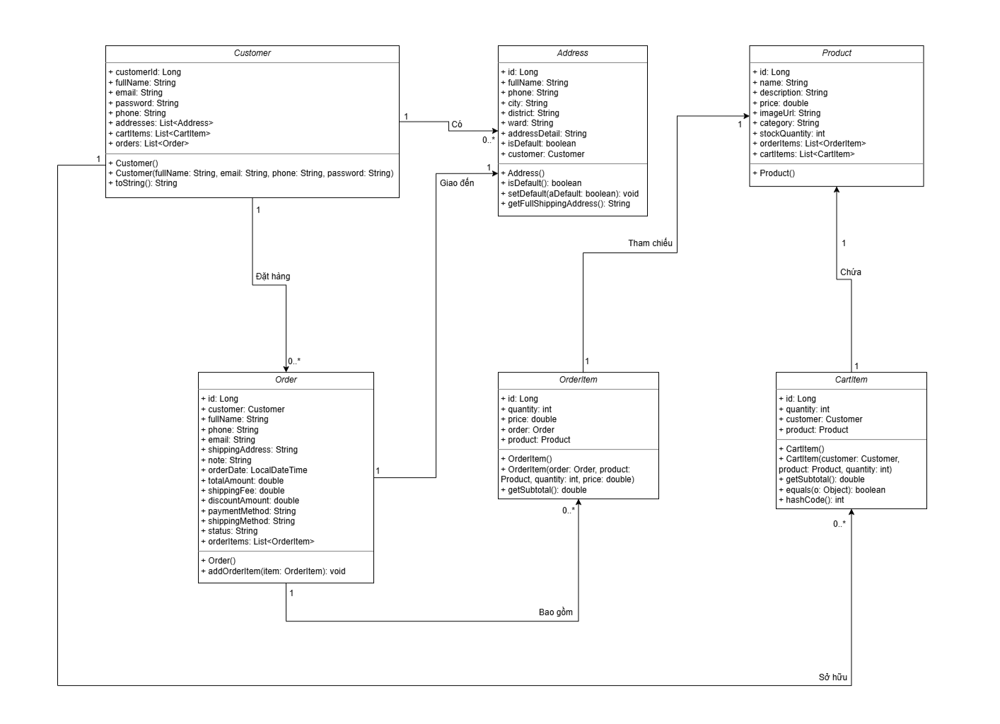
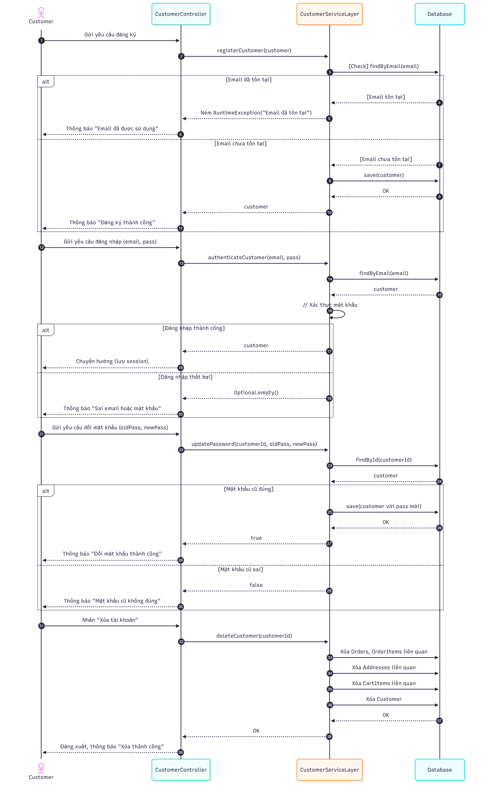
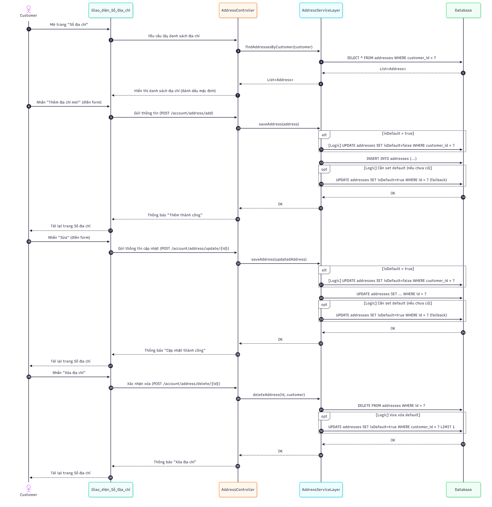
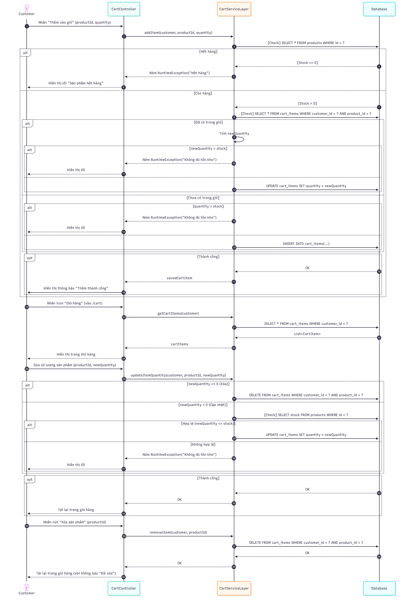
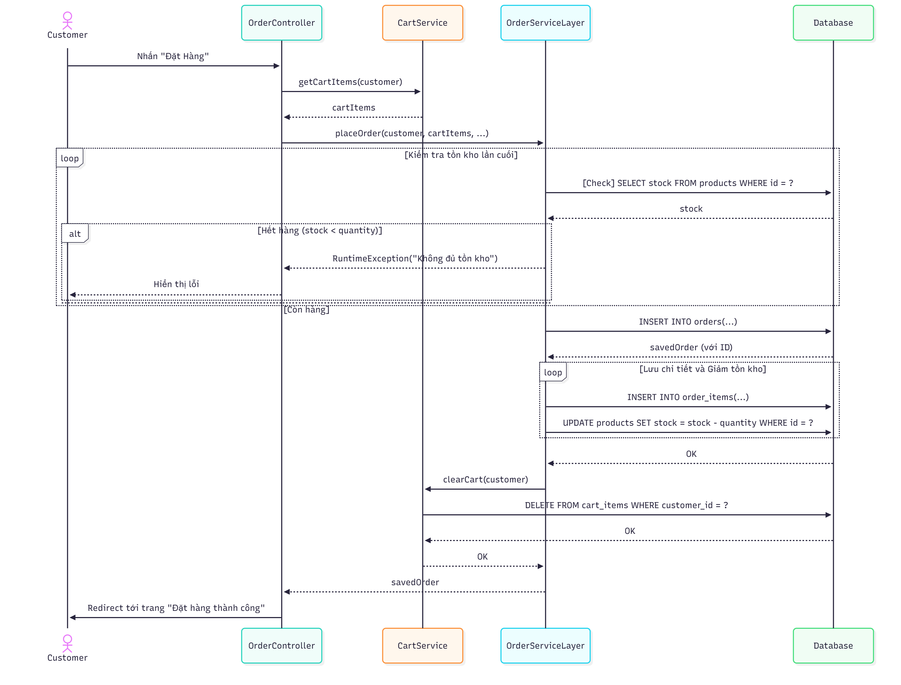

# Nhóm 10: Xây dựng website Thương mại điện tử Lumor Studio - Nội thất và Decor
# Link online: https://lumor-499510.as.r.appspot.com/

## Thành viên Nhóm 10

1.  **Lê Hoàng Đức Mạnh** - *23010456* - *K17-KHMT_1*
2.  **Nguyễn Thanh Hải** - *23010407* - *K17-KHMT_1*
3.  **Lê Nguyễn Hải Anh** - *23010006* - *K17-KHMT_1*
4.  **Lê Mạnh Cường** - *23010224* - *K17-KHMT_1*

---

## Nội dung [Content]

Lumor Studio là một ứng dụng website thương mại điện tử chuyên cung cấp các sản phẩm nội thất và đồ trang trí (decor). Hệ thống được xây dựng theo kiến trúc Client - Server kết hợp mô hình MVC, cung cấp đầy đủ các tính năng mua sắm trực tuyến từ việc duyệt sản phẩm, quản lý giỏ hàng đến thanh toán và quản trị tài khoản cá nhân.

---

## Yêu cầu chính [Main Features]

* **Giao diện:** Xây dựng giao diện người dùng web thân thiện sử dụng Thymeleaf, HTML, CSS, và JavaScript.
* **Quản lý Sản phẩm:**
    * Hiển thị danh sách sản phẩm theo danh mục, sản phẩm mới, bán chạy, gợi ý,...
    * Xem chi tiết thông tin sản phẩm.
    * Tìm kiếm sản phẩm theo tên.
* **Quản lý Giỏ hàng:**
    * Thêm sản phẩm vào giỏ.
    * Xem giỏ hàng.
    * Cập nhật số lượng sản phẩm.
    * Xóa sản phẩm khỏi giỏ.
    * Áp dụng mã giảm giá (GIAM10).
* **Quản lý Tài khoản Khách hàng:**
    * Đăng ký, đăng nhập, đăng xuất.
    * Xem và quản lý thông tin cá nhân.
    * Đổi mật khẩu.
    * Quản lý sổ địa chỉ (thêm, sửa, xóa, đặt làm mặc định).
    * Xem lịch sử đơn hàng.
    * Xóa tài khoản.
* **Thanh toán (Checkout):**
    * Điền thông tin giao hàng, chọn phương thức vận chuyển, thanh toán (COD, VNPay).
    * Xác nhận và đặt hàng.
    * Hiển thị trang xác nhận đơn hàng thành công.

---

## Công nghệ sử dụng [Technologies Used]

* **Backend:** Java 17, Spring Boot 3.5.6
    * Spring Web
    * Spring Data JPA
    * Hibernate
* **Frontend:** Thymeleaf, HTML5, CSS3, JavaScript
* **Database & Hosting:** * Cơ sở dữ liệu **MySQL** được triển khai trực tuyến trên nền tảng điện toán đám mây **Aiven Cloud** nhằm đảm bảo tính sẵn sàng cao.
    * Công cụ quản trị CSDL (Database Client): **DBeaver**.
* **Build Tool:** Maven, Git, GitHub.

---

## Sơ đồ UML [UML Diagrams]

### 1. Sơ đồ lớp [Class Diagram]

### 2. Sơ đồ trình tự [Sequence Diagrams]

* **Quản lý Tài khoản:**
    
* **Quản lý Địa chỉ:**
    
* **Quản lý Giỏ hàng:**
    
* **Chức năng chính - Đặt hàng:**
    

---

## Hướng dẫn cài đặt & Chạy [Setup & Run]
1.  Clone repository: `git clone https://github.com/FeliksWatterson/KTMP_COUR01_GROUP_10.git`
2.  Mở dự án bằng IDE (IntelliJ IDEA, Eclipse, VSCode...).
3.  Tạo file `.env` tại thư mục dự án với nội dung `DB_PASSWORD=mật_khẩu` để cấu hình bảo mật kết nối database MySQL trên Aiven Cloud.
4.  Chạy ứng dụng Spring Boot (chạy file `WebBanHangApplication.java` hoặc lệnh `./mvnw spring-boot:run`).
5.  Truy cập `http://localhost:8080`.
